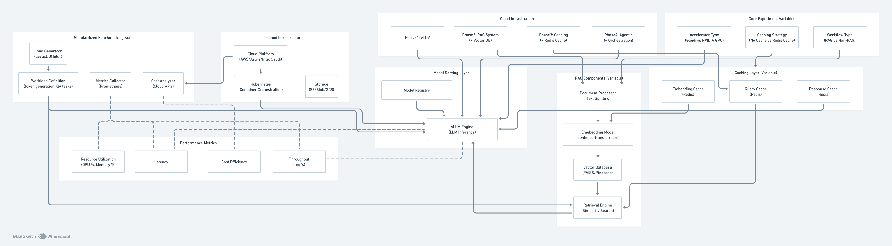

# Optimizing Cloud-Based Inference for RAG and Agentic Workloads

## Project Overview

This project focuses on optimizing cloud-based inference for RAG (Retrieval-Augmented Generation) and agentic workloads. We will explore how modern AI inference workloads can be efficiently served using cloud-native infrastructure, evaluating different components including model serving frameworks, orchestration layers, caching strategies, and GPU/accelerator utilization. The key objective is to identify performance and cost trade-offs when deploying these systems on major cloud platforms.

## 1. Vision and Goals Of The Project:

**Vision**: To deliver a comprehensive benchmarking framework that enables organizations to make informed decisions about deploying scalable, high-performance AI inference systems in cloud environments, with particular focus on RAG and agentic workloads.

**Goals**:
- Understand AI inference architectures and how modern LLM workloads (e.g., RAG, agentic tasks) are structured and executed in cloud environments
- Deploy and manage inference stacks using tools such as vLLM and llm-d, and integrate them with open-source language models
- Configure and benchmark accelerator-based infrastructure (e.g., Intel Gaudi, NVIDIA GPUs) for high-performance model serving
- Design and run benchmarking experiments to evaluate inference performance in terms of latency, throughput, scalability, and cost

## 2. Users/Personas Of The Project:

**Primary Users**:
- ML Engineers who need to deploy and optimize LLM inference systems in production environments
- Cloud Architects responsible for designing scalable cloud infrastructure for AI workloads
- DevOps Engineers who manage and maintain AI inference systems in cloud environments

**Secondary Users**:
- Research Teams conducting experiments on LLM performance and efficiency
- Product Managers making decisions about AI infrastructure investments

## 3. Scope and Features Of The Project:

**In Scope**:
- Core inference engine using vLLM with orchestration via llm-d
- RAG system implementation with document processing, embedding generation, and vector search
- Caching layer using Redis for embeddings, queries, and responses
- Standardized benchmarking suite with performance measurement tools (Locust/JMeter, Prometheus)
- Multi-cloud support for AWS, Azure, and Intel Gaudi accelerator testing
- Performance metrics including throughput, latency, resource utilization, and cost efficiency analysis

**Out of Scope**:
- Custom model training or fine-tuning
- Real-time production deployment beyond testing environments
- Integration with proprietary cloud services not available for testing
- Long-term production monitoring and maintenance

## 4. Solution Concept

### Global Architectural Structure Of the Project:

The architecture follows a phased approach with four distinct phases:

**Phase 1: vLLM** - Basic vLLM setup for LLM inference
**Phase 2: RAG System (+ Vector DB)** - Integration of Retrieval Augmented Generation system with Vector Database
**Phase 3: Caching (+ Redis Cache)** - Incorporation of caching using Redis
**Phase 4: Agentic (+ Orchestration)** - Addition of agentic capabilities and orchestration

The system includes standardized benchmarking suite components (Load Generator, Workload Definition, Metrics Collector, Cost Analyzer), cloud infrastructure (Kubernetes, Storage, Model Registry), RAG components (Document Processor, Embedding Model, Vector Database, Retrieval Engine), and caching layer (Embedding Cache, Query Cache, Response Cache).

### Design Implications and Discussion:

The phased approach allows for incremental complexity and performance measurement at each stage. The modular design enables independent testing of components while maintaining system integration. The standardized benchmarking suite ensures consistent and comparable results across different configurations and cloud platforms.

## 5. Acceptance criteria

**Minimum Acceptance Criteria**:
- Successfully deploy vLLM engine on at least two cloud platforms
- Implement complete RAG pipeline with vector database integration
- Deploy Redis caching layer with measurable performance improvements
- Create standardized benchmarking suite with automated metrics collection
- Generate comparative analysis report covering performance and cost metrics
- Document best practices for cloud-based AI inference deployment

**Stretch Goals**:
- Support for agentic workflows with tool integration
- Real-time cost optimization recommendations
- Automated scaling policies based on workload patterns

## 6. Release Planning:

**Sprint 1 (09/24 – 10/07)**  
**Tasks:**  
- Provision cloud resources (at least 2 providers: AWS/GCP or Azure)  
- Deploy basic vLLM engine in a Kubernetes cluster  
- Set up CI/CD pipeline for reproducible deployments  
- Develop initial benchmarking suite (focus on latency, throughput, TTFT)  
- Run baseline performance tests on CPU-only and single-GPU setups  

**Deliverables:**  
- Running vLLM inference service on the cloud  
- First version of benchmarking toolkit  
- Documented baseline metrics report  

**Sprint 2 (10/08 – 10/28)**  
**Tasks:**  
- Build and integrate document processing pipeline (text, PDFs, structured data)  
- Deploy vector database (FAISS or Pinecone) and embedding model (sentence-transformers)  
- Implement retrieval engine for similarity search  
- Conduct RAG-specific benchmarking (retrieval latency, embedding throughput, query-response time)  
- Run scalability tests with increasing dataset sizes  

**Deliverables:**  
- Functional document ingestion and processing pipeline  
- Fully deployed vector database and embedding model  
- Working retrieval engine integrated with RAG pipeline  
- Performance report on RAG workloads, including retrieval-specific metrics  

**Sprint 3 (10/29 – 11/04)**  
**Tasks:**  
- Deploy Redis caching infrastructure (cluster mode with persistence enabled)  
- Implement three cache types:  
  - Embedding Cache  
  - Query Cache  
  - Response Cache  
- Optimize cache configurations (eviction policies, memory allocation, sharding)  
- Conduct A/B experiments to measure performance with vs. without caching  
- Analyze cache hit/miss rates and their impact on end-to-end latency  

**Deliverables:**  
- Running Redis cluster with all cache types enabled  
- Optimized cache configuration tuned for workload patterns  
- Benchmark report showing cache performance improvements (latency, throughput, cost-efficiency)

**Sprint 4 (11/05 – 11/18)**  
**Tasks:**  
- Deploy orchestration layer for complex workflows (Kubernetes-native orchestration + workflow engine)  
- Integrate MCP Server for model context protocol management  
- Implement agentic task management (multi-step workflows, tool integration, decision branching)  
- Enable heterogeneous scheduling (dynamic CPU/GPU task routing based on workload)  
- Conduct stress testing and workflow-level benchmarking (latency, throughput, fault tolerance)  
- Document system behavior under scaling and failure scenarios  

**Deliverables:**  
- Fully functional orchestration layer integrated with inference stack  
- MCP Server deployed and connected with agentic workflows  
- Heterogeneous scheduler tested on mixed CPU/GPU workloads  
- Benchmark report on complex agentic workflows  
- Documentation of fault tolerance, scaling behavior, and workflow resilience  

**Sprint 5 (11/19 – 12/07)**  
**Tasks:**  
- Conduct end-to-end benchmarking across all components (vLLM, RAG, caching, orchestration)  
- Perform cross-cloud comparison (AWS, GCP, Azure, Intel Gaudi vs. NVIDIA GPUs)  
- Optimize autoscaling and resource utilization policies (HPA, cluster autoscaler)  
- Conduct cost-performance trade-off analysis under varying workloads  
- Finalize best practices and recommendations for deployment  
- Prepare demo scripts, visualization dashboards, and presentation slides  

**Deliverables:**  
- Complete benchmarking dataset with comparative analysis across clouds and accelerators  
- Performance vs. cost analysis report (throughput, latency, TTFT, TPOT, cost per query)  
- Optimized resource scaling configurations with documented results  
- Best practices guide for deploying cloud-based inference stacks  
- Final presentation package (slides + demo walkthrough + README documentation)  

**Final Presentation (12/08)**  
**Tasks:**  
- Deliver final project presentation to stakeholders (class, mentors, evaluators)  
- Demonstrate end-to-end inference stack (vLLM + RAG + Caching + Orchestration + Agentic workflows)  
- Present benchmarking results with visualizations (latency, throughput, cost, scaling trends)  
- Highlight cross-cloud comparison findings (AWS vs. GCP vs. Azure, NVIDIA vs. Gaudi accelerators)  
- Share lessons learned, limitations, and future directions  

**Deliverables:**  
- Live demo of the complete inference and benchmarking framework  
- Final presentation slides and report submitted  
- Visualization dashboards showcasing benchmark results  
- Documented best practices and recommendations for cloud-native AI inference deployment  

## General comments

Remember that you can always add features at the end of the semester, but you can't go back in time and gain back time you spent on features that you couldn't complete.

For more help on markdown, see
https://github.com/adam-p/markdown-here/wiki/Markdown-Cheatsheet

In particular, you can add images like this (clone the repository to see details):

