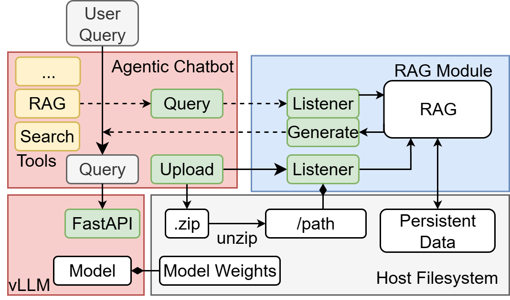

# Optimizing Cloud-Based Inference for RAG and Agentic Workloads


## Demos

| Sprint Demo | Video Link | Slide Link |
|-------------|------------|------------|
| Sprint Demo 1 | [Video](https://www.youtube.com/watch?v=v3LFXQYkRXo) | [Slide](https://docs.google.com/presentation/d/1RKOQLFk7j06XYhz2eu14nveVqJZbtXoV1pJ_SUVzOQ0/edit?usp=sharing) |
| Sprint Demo 2 | [Video](https://www.youtube.com/watch?v=Pz9SPYjU44A) | [Slide](https://docs.google.com/presentation/d/1xcg1yExD1PbtTbb1ODC60_QOhbu30eTdOSZrnwLKf6M/edit?slide=id.p#slide=id.p) |
| Sprint Demo 3 | [Video](https://www.youtube.com/watch?v=B-cUFVQ3fV8) | [Slide](https://docs.google.com/presentation/d/1K8mjWcFrNDsJg8l7XhaECn3zOihUX77A3zC7vWq-dfc/edit?slide=id.p#slide=id.p) |
| Sprint Demo 4 | [Video](https://youtu.be/ww_i0jRqoWs) | [Slide](https://docs.google.com/presentation/d/1gTOZAZpYl7pMvKpSyjIa4-UtdyC6LqhwaGmSyOOltd8/edit?slide=id.p#slide=id.p) |
| Sprint Demo 5 | [Video](https://youtu.be/uFlpQv9uCWs) | [Slide](https://docs.google.com/presentation/d/18oxq1IHBBZnWGFMnl9pNE8XsUA7HieByX6wQb-Mv79Q/edit?slide=id.p#slide=id.p) |
| Final Presentation | TBD | TBD |

## Getting Started (WIP)
- Launch instance on openstack
    - Make sure "vLLM serve" is a security group
    - Assign a floating IP
- Attach volume "All-Models" to instance, with path /dev/vdb
- SSH using the IP to connect to the instance
- Mount the volume using
  `sudo mount -t ext4 /dev/vdb /data`
- Run vLLM backend with `conda activate vllm`
- Run `vllm serve /data/Phi-3-mini-4k-instruct --api-key=(API KEY GOES HERE)`
   - using Phi-3-mini since it is lightweight for demo purposes
- Modify configuration file (./config.yaml) on local machine and replace IP address
- Launch chatbot on local machine with `python ./app.py`
- Observe benchmarking metrics and others in the vLLM backend
  
**AFTER DONE USING**
- Delete instance
- Make sure to discard floating IPs

## Project Structure

```
./chatbotbasic/WebChat: Agentic chatbot implementation
./RAG: Retrieval-Augmented Generation module
./benchmark-suite/bench.py: Standardized benchmarking suite for performance testing
./deploy: Deployment scripts and configurations for cloud platforms
./podman-compose.yml: Podman compose file for container orchestration
```

---

## Project Overview

This project focuses on optimizing cloud-based inference for RAG (Retrieval-Augmented Generation) and agentic workloads. We will explore how modern AI inference workloads can be efficiently served using cloud-native infrastructure, evaluating different components including model serving frameworks, orchestration layers, caching strategies, and GPU/accelerator utilization. The key objective is to identify performance and cost trade-offs when deploying these systems on major cloud platforms.

## 1. Vision and Goals Of The Project:

**High-Level Goals**:
- End-to-End Inference Flow: Build and deploy a complete inference pipeline that supports both simple chatbot interactions and more advanced agentic use cases (e.g., automating domain-specific tasks).
- Retrieval-Augmented Generation (RAG): Implement RAG pipelines that enhance inference by incorporating external, domain-specific data at query time, improving relevance and adaptability of outputs.
- Deployment on Cloud Infrastructure: Containerize and manage the inference stack within a Kubernetes cluster, enabling reproducible, scalable deployments.
- Benchmarking and Best Practices: Develop a standardized benchmarking suite to compare configurations, analyze results, and compile findings into a final report.

## 2. Users/Personas Of The Project:

**Primary Users**:
- ML Engineers who need to deploy and optimize LLM inference systems in production environments
- Cloud Architects responsible for designing scalable cloud infrastructure for AI workloads
- DevOps Engineers who manage and maintain AI inference systems in cloud environments

**Secondary Users**:
- Research Teams conducting experiments on LLM performance and efficiency
- Product Managers making decisions about AI infrastructure investments

## 3. Scope and Features Of The Project:

**In Scope**:
- Core inference engine using vLLM with orchestration via llm-d
- RAG system implementation with document processing, embedding generation, and vector search
- Caching layer using Redis for embeddings, queries, and responses
- Standardized benchmarking suite with performance measurement tools (Locust/JMeter, Prometheus)
- Multi-cloud support for AWS, Azure, and Intel Gaudi accelerator testing
- Performance metrics including throughput, latency, resource utilization, and cost efficiency analysis

**Out of Scope**:
- Custom model training or fine-tuning
- Real-time production deployment beyond testing environments
- Integration with proprietary cloud services not available for testing
- Long-term production monitoring and maintenance

## 4. Solution Concept

### Global Architectural Structure Of the Project:
This project mainly includes two parts: serving and benchmarking.

For serving, the overview is shown belows. There are mainly three modules: vLLM backend, agentic chatbot, and the retriveal augmented generation module. Agentic chatbot acts as an interface between LLMs and users. When user's query comes, chatbot can automatically parse LLM's response and call corresponding tools if necessary. Additionally, there is a RAG module that can store and manage files uploaded by users.



For the benchmarking, we devise a unified benchmark script that can simulate user request for stress testing. It has two mode: constant request rate and flooding, where the request arrives at a steady pace in the former mode and all requests arrives at the same time in the latter mode. Users can use option to customize the benchmarking to simulate different scenarios.

### Design Implications and Discussion:

To accommodate cloud computing, all components in the serving part can designed to be containerized. With enough computing resources and proper configurations, the system can have high availability and be robust to the single point of failure (SPOF). At the same time, it also allows the dynamic scaling just in case the computing resource runs out.

## 5. Acceptance criteria

**Acceptance Criteria**:
- ✅ Successfully deploy vLLM engine on at least two cloud platforms
- ✅ Implement complete RAG pipeline with vector database integration
- ✅ Create standardized benchmarking suite with automated metrics collection
- ✅ Generate comparative analysis report covering performance and cost metrics
- ✅ Document best practices for cloud-based AI inference deployment
- ✅ Support for agentic workflows with tool integration
